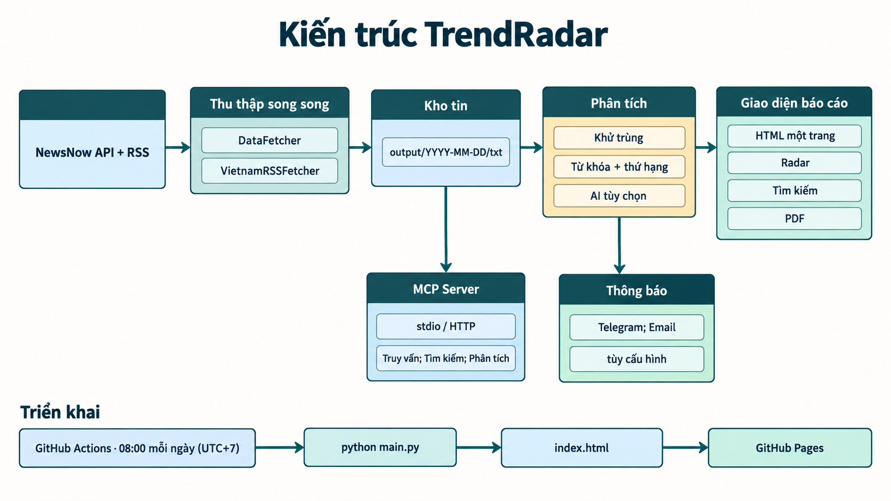
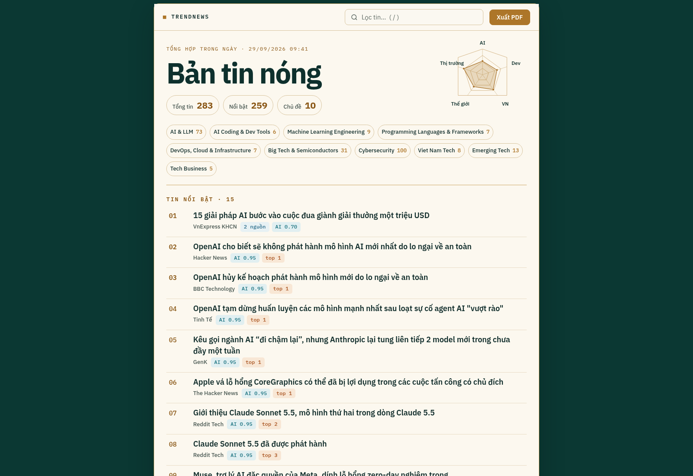

# Kiến trúc TrendRadar

Trang này mô tả luồng đang được triển khai trong mã nguồn. Ảnh phía trên được tạo bằng GPT Image để dễ đọc nhanh; sơ đồ Mermaid bên dưới là bản văn bản chính xác để sửa khi kiến trúc thay đổi.

## Luồng dữ liệu

```mermaid
flowchart LR
    cfg["config/config.yaml<br/>179 nguồn + chế độ báo cáo"]
    words["config/frequency_words.txt<br/>nhóm từ khóa theo dõi"]

    subgraph crawler["Crawler · main.py"]
        main["main.py<br/>NewsAnalyzer chính"]
        newsnow["DataFetcher<br/>NewsNow API"]
        rss["VietnamRSSFetcher<br/>RSS"]
        snapshot["data_processor.py<br/>lưu/đọc snapshot TXT"]
        processors["processors/<br/>lọc · khử trùng · thống kê"]
        analysis["analysis/<br/>AI tùy chọn"]
        renderer["HTMLRenderer<br/>HTML một trang"]
        notify["notifiers/<br/>Telegram · Email"]

        cfg --> main
        main -->|thu thập song song| newsnow
        main -->|thu thập song song| rss
        newsnow --> snapshot
        rss --> snapshot
        snapshot --> processors
        words --> processors
        processors --> analysis
        processors --> renderer
        analysis --> renderer
        analysis -.-> notify
    end

    subgraph archive["Kho theo ngày · output/YYYY-MM-DD/"]
        raw["txt/<br/>snapshot tin đã thu thập"]
        html["html/<br/>báo cáo lưu trữ"]
    end
    snapshot --> raw
    renderer --> html
    renderer -->|báo cáo tổng hợp trong ngày| index["index.html ở thư mục gốc"]

    subgraph mcp["MCP server · tiến trình riêng"]
        tools["FastMCP<br/>stdio hoặc HTTP"]
        client["MCP client / trợ lý AI"]
        tools <--> client
    end
    raw -->|đọc kho dữ liệu| tools

    subgraph deploy["Triển khai báo cáo web"]
        schedule["GitHub Actions<br/>08:00 mỗi ngày · UTC+7"]
        run["python main.py"]
        page["GitHub Pages<br/>chỉ index.html"]
        schedule --> run --> index --> page
    end

    classDef source fill:#e7f1f0,stroke:#31766c,color:#102f2a;
    classDef processing fill:#fff3dc,stroke:#b77b22,color:#3e2e12;
    classDef output fill:#edf3f8,stroke:#476d8b,color:#172b3a;
    class cfg,words,newsnow,rss source;
    class main,snapshot,processors,analysis processing;
    class renderer,notify,raw,html,index,page,tools,client,schedule,run output;
```

`src/core/analyzer.py` hiện là lớp placeholder đơn giản và được re-export bởi `src.core`; luồng chạy đầy đủ không gọi lớp đó. Lớp `NewsAnalyzer` thực sự được định nghĩa trong `main.py`.

## Thành phần và ranh giới

| Thành phần | Vai trò |
| --- | --- |
| `main.py` | Điểm vào của crawler: đọc cấu hình, chia nguồn NewsNow/RSS, chạy hai bộ thu thập song song, điều phối phân tích, báo cáo và thông báo. |
| `src/core/` | `DataFetcher` gọi NewsNow API; `VietnamRSSFetcher` đọc RSS; `PushRecordManager` quản lý giới hạn gửi thông báo. |
| `src/processors/` | Lưu và đọc snapshot TXT theo ngày, phát hiện tin mới, khớp từ khóa, tính thống kê và gộp tiêu đề trùng. |
| `src/analysis/` | Các bước AI có thể cấu hình: lọc theo sở thích, dịch tiêu đề và phân tích nhóm tài sản. AI không thay thế khâu thu thập. |
| `src/renderers/html_renderer.py` | Sinh HTML báo cáo theo dữ liệu đã xử lý; báo cáo tổng hợp hằng ngày cũng ghi ra `index.html`. |
| `src/notifiers/` | Gửi báo cáo qua Telegram hoặc email khi bật thông báo và có thông tin đăng nhập. |
| `mcp_server/` | Tiến trình độc lập dùng FastMCP; cung cấp truy vấn, tìm kiếm, phân tích, cấu hình, trạng thái và công cụ yêu cầu crawl. Nó đọc `output/` tại môi trường chạy MCP, không phải giao diện web. |
| GitHub Actions + Pages | Workflow chạy theo lịch, cập nhật báo cáo rồi upload duy nhất `index.html` để phục vụ trang tĩnh. |
| Docker | Chạy crawler theo lịch Supercronic; Compose gắn cấu hình và kho `output/` từ máy chủ. |

## Giao diện báo cáo

Frontend không dùng React/Vue hoặc bundler riêng. `HTMLRenderer` tạo một trang HTML với CSS và JavaScript nhúng trực tiếp; biểu đồ radar được dựng bằng SVG. Giao diện hiện tại có:

- Thanh tìm kiếm trực tiếp, có thể nhấn `/` để focus.
- Radar chủ đề và thống kê tổng quan.
- Nhóm tin nổi bật, các nhóm từ khóa, khu vực tin mới và liên kết đến bài gốc.
- Nút **Xuất PDF** mở hộp thoại in của trình duyệt; chọn “Save as PDF” để lưu. Liên kết bài viết vẫn là anchor trong tài liệu in.
- Bố cục responsive cho màn hình nhỏ và quy tắc in A4.

## Lưu trữ và triển khai

- Máy cá nhân/Docker: snapshot và HTML được lưu dưới `output/<ngày>/`; Docker Compose mount thư mục này ra ngoài container để giữ lịch sử.
- GitHub Actions: `output/` bị `.gitignore`, vì vậy kho lịch sử không được giữ giữa các runner. Mỗi lượt chạy vẫn có dữ liệu vừa thu thập để tạo báo cáo; `index.html` ở root được commit và dùng để deploy.
- Lịch workflow trong [`.github/workflows/crawler.yml`](../.github/workflows/crawler.yml) là `01:00 UTC`, tương ứng **08:00 UTC+7**. Có thể chạy thêm bằng `workflow_dispatch`.
- GitHub Pages nhận một artifact chỉ gồm `index.html`; source code và file cấu hình không được đưa vào artifact trang web.
- Lịch trong Docker độc lập với lịch GitHub Actions và lấy giá trị từ `CRON_SCHEDULE` (Compose hiện đặt mặc định 5 phút một lần).
